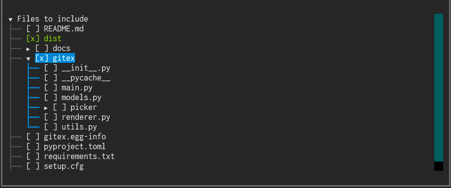

<p align="center">
  <a href="https://excalidraw.com/#json=FcO55BsQn51s2Pqqt5rrK,oh1x03sJwQH__qTI1Zd1tw">
    
  </a>
</p>


# gitex

🛠️ Terminal tool to prep your 🧠 codebase (whole or partial) for LLMs — clean, compress, and convert it into prompt-ready text! 🚀📦


## 📝 To-Do
- [x] Display GitHub repository structure
- [x] Select files/directories to include
- [ ] Filter files by extensions
- [x] Generate formatted text file
- [ ] Copy text to clipboard
- [ ] Download generated text
- [x] Support for private repositories
- [ ] Download zip of selected files
- [x] Local directory support
- [x] make into pypi package

## ✨ Features

### 📚 Docstring Extraction
Extract and format docstrings and function/class signatures from Python files, inspired by Sphinx. Perfect for providing high-level context to LLMs without implementation noise.
- Extract from all Python files: `gitex . --extract-docstrings`
- Extract from a specific class or function: `gitex . --extract-docstrings gitex.renderer.Renderer`
- Control empty classes: `gitex . --extract-docstrings --include-empty-classes`

### 🔗 Dependency & Relationship Mapping  
Analyze and visualize code architecture, dependencies, and relationships in your codebase. Essential for understanding how components interact before diving into implementation details.
- **Full analysis**: `gitex . --map-dependencies`
- **Focus on imports**: `gitex . --map-dependencies imports`
- **Focus on inheritance**: `gitex . --map-dependencies inheritance` 
- **Focus on function calls**: `gitex . --map-dependencies calls`

**What it maps:**
- 📦 **Import dependencies** - Which files depend on which other files
- 🏗️ **Class inheritance hierarchies** - Parent-child relationships between classes
- 🔄 **Function call relationships** - Which functions call which other functions
- 📊 **Summary statistics** - Overview of codebase complexity and external dependencies


## 📥 Installation
```bash
$ pip install gitex
```


## ▶️ Usage
```
$ gitex --help
$ gitex .             # current repository
$ gitex path/to/repo  # any repo path
$ gitex url           # repo url
...
```


## 📸 Demo



## 🙏 Acknowledgments
This project draws inspiration from [repo2txt](https://github.com/abinthomasonline/repo2txt) by [@abinthomasonline](https://github.com/abinthomasonline).  
Big thanks for laying the groundwork for converting repositories into prompt-ready text!
