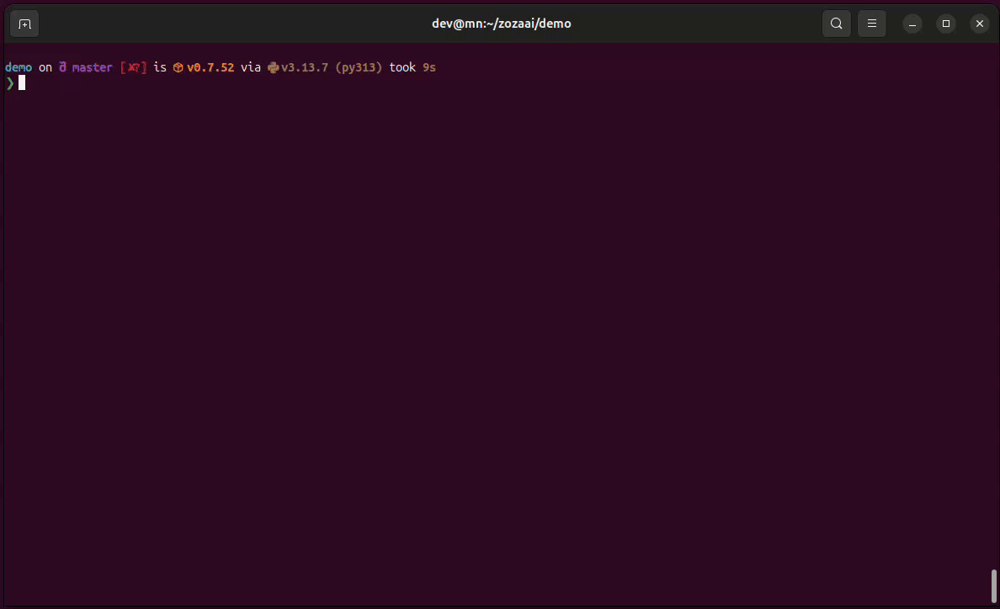

<p align="center">
  <a href="https://excalidraw.com/#json=FcO55BsQn51s2Pqqt5rrK,oh1x03sJwQH__qTI1Zd1tw">
    
  </a>
</p>

<p align="center">
  <a href="https://github.com/zozaai/gitex/actions/workflows/ci.yml">
    
  </a>
  <a href="https://codecov.io/gh/zozaai/gitex">
    
  </a>
</p>

<p align="center">  
  🛠️ Terminal tool to prep your codebase (whole or partial) for LLMs, clean, compress, and convert it into prompt-ready text! 🚀📦
</p>

<p align="center">
  
</p>


## 📥 Installation

Install the package via pip:

```bash
pip install gitex
```

## 📋 Clipboard support (Linux)

#### Ubuntu/Debian
```bash
# Wayland (recommended):
sudo apt install -y wl-clipboard

# X11 alternatives:
sudo apt install -y xclip
# or
sudo apt install -y xsel
```

## ▶️ Usage

`gitex` helps you bundle your codebase into a single, LLM-friendly text format. It respects your `.gitignore` by default and provides several ways to filter content.

### Basic Examples
```bash
gitex .                                 # Process current directory and copy to clipboard
gitex -i                                # Launch the interactive TUI to pick specific files/folders
gitex /path/to/repo --force             # Force process a directory even if it's not a Git repo
gitex . --no-files                      # Render the directory tree ONLY (omit file contents)
```

### Advanced Filtering & Combinations
```bash
gitex . -a                              # Include hidden files (those starting with .)
gitex . -g                              # Ignore .gitignore rules (process everything)
gitex . -ag                             # Combine: Show hidden files AND ignore .gitignore
gitex . -iv                             # Interactive selection with verbose output to terminal
gitex . -v                              # Verbose: Print to terminal AND copy to clipboard
gitex . > codebase.txt                  # Redirect output to a text file
```

### Intelligence Features
```bash
gitex . -ds                             # Extract only Python docstrings and signatures
gitex . --map-dependencies              # Analyze code relationships (imports, inheritance, calls)
```

## 🙏 Acknowledgments
This project draws inspiration from [repo2txt](https://github.com/abinthomasonline/repo2txt) by [@abinthomasonline](https://github.com/abinthomasonline).  
Big thanks for laying the groundwork for converting repositories into prompt-ready text!

---

<details>
<summary><b>📚 Click to expand: Docstring Extraction Details</b></summary>

### Python Docstring Extraction
Extract and format docstrings and function/class signatures from Python files, inspired by Sphinx. Perfect for providing high-level context to LLMs without implementation noise.

*   **Extract from all Python files:**  
    `gitex . --extract-docstrings`
*   **Extract from a specific class or function:**  
    `gitex . --extract-docstrings gitex.renderer.Renderer`
*   **Include classes/functions even if they have no docstrings:**  
    `gitex . --extract-docstrings --include-empty-classes`

</details>

<details>
<summary><b>🔗 Click to expand: Dependency & Relationship Mapping Details</b></summary>

### Architecture Analysis
Analyze and visualize code architecture, dependencies, and relationships in your codebase. Essential for understanding how components interact before diving into implementation details.

*   **Full analysis:** `gitex . --map-dependencies`
*   **Focus on imports:** `gitex . --map-dependencies imports`
*   **Focus on inheritance:** `gitex . --map-dependencies inheritance` 
*   **Focus on function calls:** `gitex . --map-dependencies calls`

**What it maps:**
*   📦 **Import dependencies** - Which files depend on which other files.
*   🏗️ **Class inheritance hierarchies** - Parent-child relationships between classes.
*   🔄 **Function call relationships** - Which functions call which other functions.
*   📊 **Summary statistics** - Overview of codebase complexity and external dependencies.

</details>